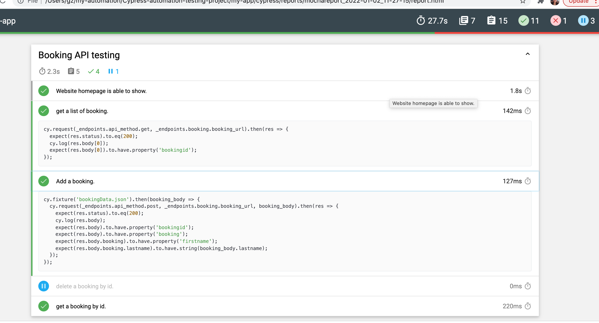
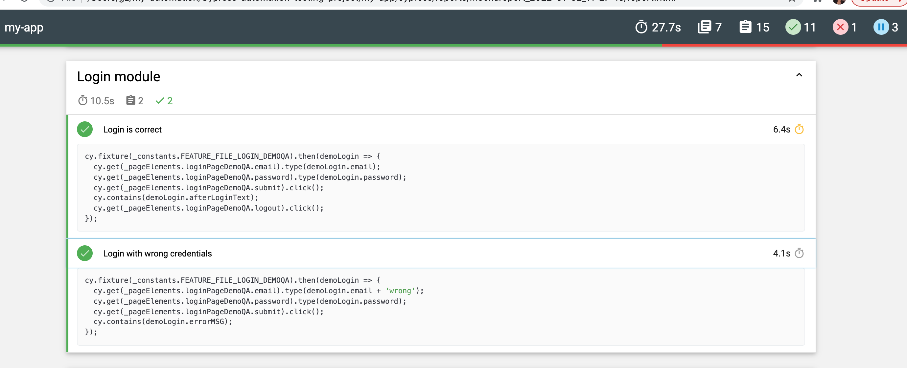

# Install
### xpath plugin
```
yarn add cypress-xpath --dev
```
Then include in your project's cypress/support/index.js

```
require('cypress-xpath')
```
### Code coverage
```
npm install -D @cypress/code-coverage
```
In cypress/support/index.js 

```
// cypress/support/index.js
import '@cypress/code-coverage/support'
```
In cypress/plugins/index.js

```
// cypress/plugins/index.js
module.exports = (on, config) => {
  require('@cypress/code-coverage/task')(on, config)
  // include any other plugin code...

  // It's IMPORTANT to return the config object
  // with any changed environment variables
  return config
}
```
Run a test:
```
yarn cypress open
```
View coverage summary

```
npx nyc report --reporter=text-summary

========= Coverage summary =======
Statements   : 76.3% ( 103/135 )
Branches     : 65.31% ( 32/49 )
Functions    : 64% ( 32/50 )
Lines        : 81.42% ( 92/113 )
==================================
```
Open from the folder:

```
my-app/coverage/lcov-report/index.html
```
### Test report
* install 
 
  ```
  yarn add -D mocha cypress-multi-reporters mochawesome
  ```

* add to cypress.json
  
  ```
  "reporter": "cypress-multi-reporters",
  "reporterOptions": {
    "configFile": "reporter-config.json"
  }
  ```

* add a file at the root of the project: reporter-config.json with
 
  ```
  {
      "reporterEnabled": "mochawesome",
      "mochawesomeReporterOptions": {
          "reportDir": "cypress/reports/mochareports",
          "overwrite": false,
          "html": false,
          "json": true
      }
  }
  ```
* install
  
   ```
   yarn add -D mochawesome-merge
   ```
* run
  
  ```
  npx mochawesome-merge cypress/reports/mocha/*.json > cypress/reports/mochareports/report.json 

  npx marge cypress/reports/mochareports/report.json -f report -o cypress/reports/mochareports
  ```

* or follow here:

  [use npm](https://dev.to/bushraalam/using-mochawesome-reporter-with-cypress-54pf)

# How to run
* use npm
  ```
  npm run test
  ```
* use yarn
  ```
  bash run-tests-with-report.sh
  ```
* view html report
  
  folder: /my-app/cypress/reports/mochareport/report.html

  

  


